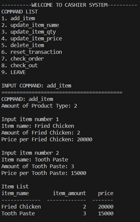
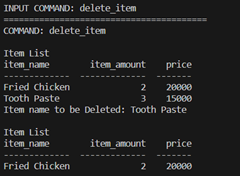
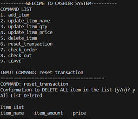
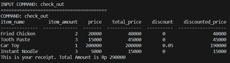

# PYTHON: (miniature) SELF-SERVICE CASHIER

## Background

"Self-Service Cashier" is a program that enable customer to input their purchased item by themselves. The system is used to minimize dependency on people.

The "Self Service Cashier" is a Python program designed to simulate a self-service cashier system for retail transactions with limited functionality. The program allows users to create a list of items they want to purchase, specifying the item name, quantity, and price per item. It provides functionalities such as adding, updating, and deleting items from the list. The program also calculates the total price, applies discounts based on the total amount, and generates a receipt with detailed transaction information. The transaction data is stored in a SQLite database for record-keeping and can be retrieved and displayed using the program.

This program is being made for the completion of a Final Project Assignment

## Tools

Languages:
+ Python
+ SQL

Libraries:
+ tabulate
+ sqlalchemy

## Objective

Learning Objective:
+ Create Self-Cashier Program using Python and SQL
+ Connecting Python program to SQLLite database
+ Write Clean and Modular Python Program using PEP8 Principle

Program Objective:
+ Input purchased item
+ Edit list of purchased item
+ Delete an item/more in the list of purchased item
+ Check list of purchased item
+ Reset list of purchased item
+ Adding new transaction data to database

## Program Flowchart

Certainly! Here's a step-by-step example of how your program could be executed:

1. The program starts.
2. The main menu is displayed.
3. The program prompts for a command input.
4. User enters a command.
5. The program identifies the command and executes the corresponding action based on the command response.
6. If the command is "add_item":
   - The program calls the `loop_add_item()` function.
   - The user is prompted to input the amount of product types.
   - The program runs the `add_item()` function for each product type and adds the items to the `item_list`.
   - The updated `item_list` is displayed.
   - Control goes back to the main menu.
7. If the command is "update_item_name", "update_item_qty", or "update_item_price":
   - The program calls the `update_item()` function with the command response.
   - The program displays the current `item_list`.
   - The user is prompted if there are any items to be updated.
   - If yes, the program prompts for the item name and the new data.
   - The `item_list` is updated with the new data.
   - Control goes back to the main menu.
8. If the command is "delete_item":
   - The program calls the `delete_item()` function.
   - The program displays the current `item_list`.
   - The user is prompted for the item name to be deleted.
   - The item is removed from the `item_list`.
   - The updated `item_list` is displayed.
   - Control goes back to the main menu.
9. If the command is "reset_transaction":
   - The program calls the `reset_transaction()` function.
   - The program prompts for confirmation to delete all items in the `item_list`.
   - If confirmed, the `item_list` is cleared and an empty list is displayed.
   - Control goes back to the main menu.
10. If the command is "check_order":
    - The program calls the `calculate_price_discount()` function.
    - The program displays the calculated total price, discount, and discounted price for each item in the `item_list`.
    - The updated `item_list` is assigned to `data_upload`.
    - Control goes back to the main menu.
11. If the command is "check_out":
    - The program calls the `upload_data()` function.
    - The program calls the `calculate_price_discount()` function to display the calculated total price, discount, and discounted price for each item in the `item_list`.
    - The transaction data is uploaded to the SQL database, and a receipt with the total amount is generated.
    - The `item_list` is cleared to prepare for the next customer / next transaction.
    - Control goes back to the main menu.
12. If the command is "check_transaction_database":
    - The program calls the `check_transaction_database()` function.
    - The program retrieves and displays all transaction data from the database.
    - Control goes back to the main menu.
13. If the command is "LEAVE":
    - The program exits the loop and ends.

This sequence of steps continues until the user chooses to exit the program by entering "LEAVE".

## Function Explanation

+ `add_item()`: Prompts the user to enter details of an item and returns a list containing the item information, including the item name, item amount, and price per item.

+ `loop_add_item(item_list)`: Prompts the user to input the number of product types and repeatedly calls `add_item()` to add items to the `item_list`. It returns the updated `item_list` with the added items.

+ `check_availability(item_name, list_data)`: Checks the availability of a specific item in a list of lists. It takes an item name and a list of lists as input and returns "available" if the item is found in the list, otherwise "not available".

+ `replace_data(updated_item_name, new_data, item_list, updated_data_type)`: Replaces the data of a specific item in a list of lists with the provided new data. It takes the updated item name, new data, item list, and updated data type as input. The updated data type can be "name", "qty", or "price". It returns the updated `item_list` after replacing the data.

+ `update_item(item_list, command_response)`: Updates the data of items in the `item_list` based on the specified `command_response`. It prompts the user to specify the type of data to be updated ("name", "qty", or "price"). It returns the updated `item_list` after applying the requested updates.

+ `delete_item(item_list)`: Deletes an item from the `item_list`. It prompts the user to enter the item name to be deleted and removes the item from the list. It returns the updated `item_list` after deleting the specified item.

+ `reset_transaction()`: Resets the transaction by deleting all items in the `item_list`. It prompts the user for confirmation before deleting all items and returns an empty `item_list` after resetting the transaction.

+ `calculate_price_discount(item_list)`: Calculates the total price, discount, and discounted price for each item in the `item_list`. It adds additional columns for total price, discount, and discounted price to each item and returns the updated `item_list`.

+ `upload_data(item_list)`: Uploads the transaction data from the `item_list` to a database and generates a receipt. It calculates the price discount using `calculate_price_discount()` and uploads the data to a SQLite database. It returns an empty `item_list` after uploading the data.

+ `check_transaction_database()`: Retrieves and displays all transaction data from the database. It connects to the SQLite database and executes a query to retrieve all transaction data. It then prints the data in a tabular format.

## Test Case

1. Test Case 1: Input 2 item\

2. Test Case 2: Delete one of the item on the list\

3. Test Case 3: Reset transaction\

4. Test Case 4: Do a checkout\
 

## Further Work

+ Further error testing for another input
+ Create database of item so that customer don't have to input the price